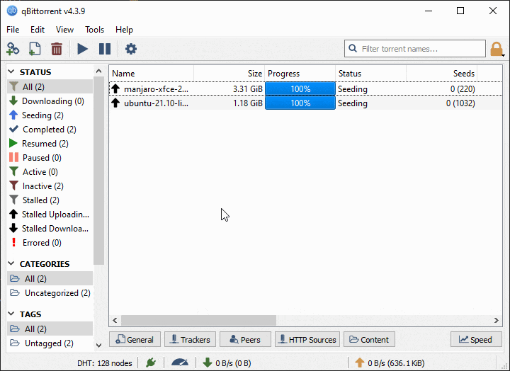

# qBt Migrate

This tool changes the root paths of existing torrents in qBittorrent.
It can also convert slashes when migrating between Windows and Linux/Mac.

## Usage

Install from PyPi using `pip`, or jump to [Examples](#Examples) for Docker

    pip install qbt_migrate

Run the script and follow prompts or use CLI arguments with command `qbt_migrate`

    usage: qbt_migrate [-h] [-e EXISTING_PATH] [-n NEW_PATH] [-r] [-t {Windows,Linux,Mac}] [-b BT_BACKUP_PATH] [-s] [-l {DEBUG,INFO}] [-v]

    options:
      -h, --help            show this help message and exit
      -e EXISTING_PATH, --existing-path EXISTING_PATH
                            Existing root of path to look for.
      -n NEW_PATH, --new-path NEW_PATH
                            New root path to replace existing root path with.
      -r, --regex           Existing and New paths are regex patterns. (Capture groups recommended).
      -t {Windows,Linux,Mac}, --target-os {Windows,Linux,Mac}
                            Target OS (converts slashes). Default will auto-detect if conversion is needed based on existing vs new.
      -b BT_BACKUP_PATH, --bt-backup-path BT_BACKUP_PATH
                            BT_backup Path Override.
      -s, --skip-bad-files  Skips bad .fastresume files instead of exiting. Default behavior is to exit.
      -l {DEBUG,INFO}, --log-level {DEBUG,INFO}
                            Log Level, Default is INFO.
      -v, --version         Prints the current version number and exits.

By default, everything happens in the BT_backup directory defined by the OS the script is running on.
Override `BT_backup` path if needed.

Default BT_backup paths:
* Windows: `%LOCALAPPDATA%/qBittorrent/BT_backup`
* Linux/Mac: `$HOME/.local/share/data/qBittorrent/BT_backup`

A backup zip archive is automatically created in the `BT_backup` directory.

### Examples
Assuming all of our torrents are in `X:\Torrents` when coming from Windows, or `/torrents` when coming from Linux/Mac

**NOTE:** When running `qbt_migrate` on a Linux/Mac machine, Windows paths will require double `\`. Ex. `C:\\Users\\user\\Downloads\\Torrents`

**NOTE:** Take note of trailing slash replacement when changing from Windows <-> Linux. `-e X:\ -n /torrents` will result in `/torrentsxxxxx`, not `/torrents/xxxxx`.
The correct pattern for this would be `-e X: -n /torrents` or `-e X:\ -n /torrents/`.

    qbt_migrate -e X:\ -n Z:\ -t Windows  # Windows to Windows (Drive letter change)
    qbt_migrate -e X:\Torrents -n X:\NewDir\Torrents -t Windows  # Windows to Windows (Directory Change)
    qbt_migrate -e X:\Torrents -n Z:\NewDir\Torrents -t Windows  # Windows to Windows (Drive letter change with directory change)
    qbt_migrate -e X: -n /torrents -t Linux  # Windows to Linux/Mac (converts slashes)  # When running on Linux machine \\ is needed for Windows Paths  # Note Trailing Slash
    qbt_migrate -e X:\Torrents -n /torrents -t Linux  # Windows to Linux/Mac (converts slashes)  # When running on Linux machine \\ is needed for Windows Paths
    qbt_migrate -e X:\\Torrents -n /torrents -t Linux  # Windows to Linux/Mac (converts slashes)  # When running on Linux machine \\ is needed for Windows Paths

    qbt_migrate -e /torrents -n /new/path/for/torrents  # Changes torrent root path on Linux/Mac
    qbt_migrate -e /torrents -n Z:\Torrents -t Windows  # Linux/Mac to Windows (converts slashes)
    qbt_migrate -e /torrents -n Z:\\Torrents -t Windows  # Linux/Mac to Windows (converts slashes)  # When running on Linux machine \\ is needed for Windows Paths

    # Adavanced Usage with RegEx
    # Example would replace /some/test/with/a/path with /test/matched/path
    qbt_migrate -r -e /some/(\w+)/.*$ -n \1/matched/path -t Linux  # Matches using regex patterns and replaces using capture groups.
    qbt_migrate --regex -e /some/(\w+)/.*$ -n \1/matched/path -t Linux  # Matches using regex patterns and replaces using capture groups.

#### Docker
You can also run this tool with Docker if you don't have Python, or don't want to install the package to your system directly.
The BT_backup path is automatically overridden to `/tmp/BT_backup`, so mount your `BT_backup` there.

**NOTE:** When running `qbt_migrate` Docker image on a Linux/Mac machine, Windows paths will require double `\`. Ex. `C:\\Users\\user\\Downloads\\Torrents`

**The Docker image has all functionality as the pip install, following the same arguments/patterns listed in the above examples.**

For example, mounting in the default BT_backup path on a Windows machine running Docker

    docker run -v %LOCALAPPDATA%/qBittorrent/BT_backup:/tmp/BT_backup jslay88/qbt_migrate -e X:\ -n Z:\  # Windows to Windows (Drive letter change)
    docker run -v %LOCALAPPDATA%/qBittorrent/BT_backup:/tmp/BT_backup jslay88/qbt_migrate -e X:\Torrents -n X:\NewDir\Torrents -t Windows  # Windows to Windows (Directory Change)
    ...

Mounting in the default BT_backup path on a Linux/Mac machine running Docker

    docker run -v $HOME/.local/share/data/qBittorrent/BT_backup:/tmp/BT_backup jslay88/qbt_migrate -e X:\ -n Z:\  # Windows to Windows (Drive letter change)
    docker run -v $HOME/.local/share/data/qBittorrent/BT_backup:/tmp/BT_backup jslay88/qbt_migrate -e X:\Torrents -n X:\NewDir\Torrents -t Windows  # Windows to Windows (Directory Change)
    ...

If for some reason you wanted to override BT_backup path from `/tmp/BT_backup` within the container, simply set
environment variable `BT_BACKUP_PATH` on the container to where you will be mounting in.

**The `-e` for environment variable override must go before the image `jslay88/qbt_migrate` as the `-e` after the image is for `--existing-path`**

    docker run -v %LOCALAPPDATA%/qBittorrent/BT_backup:/opt/qbt_migrate/fastresume -e BT_BACKUP_PATH=/opt/qbt_migrate/fastresume jslay88/qbt_migrate -e X:\ -n Z:\  # Windows to Windows (Drive letter change)
    ...

You can also clone this repository, build the image, and run your own built image

    docker build . -t qbt_migrate
    docker run -v %LOCALAPPDATA%/qBittorrent/BT_backup:/tmp/BT_backup qbt_migrate -e X:\ -n Z:\  # Windows to Windows (Drive letter change)
    ...

## Python Module
This project has also been built to be modular and used as a Python Module. If you feel like utilizing this project within your own,
please feel free to do so, and let me know!

Use Cases:
* UI for qbt_migrate
* `FastResume` Class
* Torrent Manager
